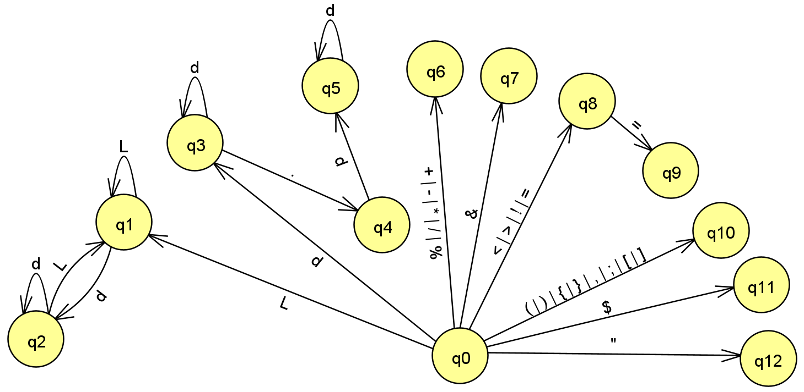

# Lemon Lang 

Repositorio: [https://github.com/bitxa/LemonLang](https://github.com/bitxa/LemonLang)

## Autores

* [Joel Romero](https://github.com/bitxa)
* [Fabián Montoya](https://github.com/f4biaan)

## Comandos y Sintaxis

* ***Crear un nuevo programa***

  Para crear un programa en el Lenguaje de Programación ***Lemon*** se debe utilizar la siguiente estructura que comienza con la palabra reservada *lemonade* seguido del nombre del programa y el codigo continido dentro de llaves ( ***{}*** ):

  ```
  lemonade myProgram {
    <code>
  }
  ```

  Además de estos delimitadors de inicio y de fin de programa, también existen delimitadores para cada línea de código, este será el  ';'.

  ```
  lemonade myProgram {
    acid myVar = "Hello, World!";
    bool myBool = true;
  }
  ```
* ***Comentarios***

  ```
  $ This is a comment
  ```
* ***Imprimir en consola***

  ```
  juice("something");
  ```
* ***Declaracion de variables***

  Una declaración o instrucción se utiliza para introducir una valor, un identificador, o una  cción, en el programa o módulo. Cada declaración termina con el carácter " ; ". En LemonLang para declarar un valor se usa el formato:

  ```
    (tipo) (identificador) = (contenido);
  ```

  Ejemplo de declaración:

  ```
  acid hola = 2;
  string cadena = 2;
  ```
* ***Tipos de variables:***

  El compilador tendra la capacidad de inferir el tipo de dato de la siguiente manera:

  * Variables inmutables

    ```
    lit myVar1 = 2;
    lit myVar2 = "This is my lang";
    ```
  * Varables mutables

    ```
    acid myVar3 = "Hello, world!";
    acid myVar3 = "Hello";

    acid myVar4 = 20;
    acid myVar4 = 23;
    ```

  Adicionalmente el compilador ofrece la opción de definir el tipo mediente el uso de los tipos pimitivos:

  * Tipo numérico

  ```
  number myNum = 200;
  ```

  * Tipo cadena

  ```
  string myStr = "My lang";
  ```

  * Tipo boleano

  ```
  bool myBool = false;
  ```
* Operaciones

  * Aritmeticas

  ```
  1 + 2 ;
  1 - 2 ;
  1 * 2 ;
  1 / 2 ;

  $ Concatenar cadenas
  "Hello" + " " + "World!"; $ Hello World!
  ```

  * Relacionales

  ```
  1 < 2 $retorna true;
  1 <= 1 ; $ retorna true;
  1 > 2 ; $ retorna false;
  1 >= 2 ; $ retorna false;
  1 == 2 ; $ retorna falso
  "a" != "b" ; $ retorna verdadero
  ```

  También podemos comprobar igualdad y desigualdad:

  ```
  1 == 2 ; $ falso
  "a" != "b" ; $ verdadero
  ```

  * Lógicos

  ```
  true & false; $ AND
  true | false; $ OR
  !true; $ NOT, retorna false
  ```

  * Flujos de control

    * Condicionales

    ```
    if (1 == 1) {
      juice("This is a simple conditional");
    }

    if (true == false) {
      juice("True part");
    } else {
      juice("False part");
    }
    ```

    * Ciclos repetitivos

    Las estructuras repetitivas para ejecutar instrucciones un número finito de veces. Aqui encontramos el ciclo **for** que ejecuta las instrucciones que contiene un número finito de veces, y se debe estructurar de la siguiente manera:

    ```
    for (number a = 1; a < 10; a = a + 1) {
      juice(a);
    }

    for (number a = 1; a < 10; a++) {
      juice(a);
    }

    for (number a = 1; a < 10; a += 1) {
      juice(a);
    }
    ```

## Terminales

* Palabras reservadas:
  * lemonade: utilizado para definir un nuevo programa.
  * if, else: condicionales
  * for: bucle
  * juice: imprime en consola
* Tipos de datos
  * number: define un valor de tipo numérico.
  * string: define una caden de caracteres.
  * acid: para declarar un valor con tipo implicito (mutable).
  * lit: para declarar un valor con tipo implícito e inmutable (constante).
  * bool: define un valore de tio boleano.
* Operadores:
  * Aritmeticos:
    * Suma: +, tambien se puede utilizar para concatenar cadenas
    * Resta: -
    * Multiplicación: *
    * División: /
  * Relacionales:
    * Menor que: <
    * Mayor que: >
    * Menor igual que: <=
    * Mayor igul que: >=
    * Igual a: ==
    * Diferente a: !=
  * Lógicos:
    * AND: &
    * OR: |
    * Negación: !
* Valores boleanos:
  * true
  * false
* Comentarios: para ignorar una linea la cual se corresponde a un comentario en el código se indicara con el signo dolar: '$'.

## Autómata integrado



## Separadores

|Tipo de datos|separadores|
|:---:|---|
|Numeros|Para identificar los números decimales el separador va a ser un . (punto)|
|String, número|Ahora para comprobar que haga terminado un número o String (Identificador o Palabra reservada) se utilizan los demás sim bolos como operadores aritmeticos (+,-,*,/,%), operadores rrelacionales (<,>,=), operadores lógicos (&, ! , |), y en caso de ser otros simbolos se comprobaran si existen en el lenguaje se continuara el análisis o sino se continua.|
